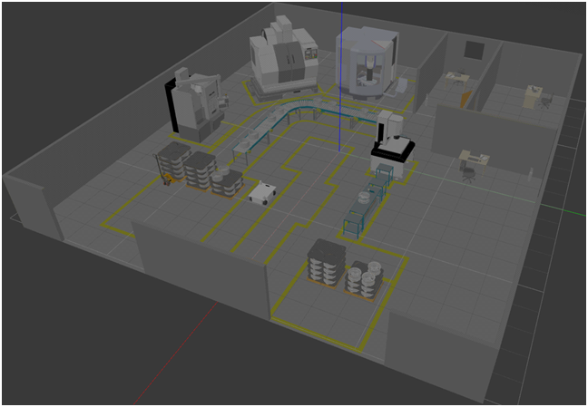

# Autonomous Guided Vehicle
Simulation of the Autonomous guided vehicle with mecanum wheels is carried out in the gazebo environment using the ROS package move_base. This package includes building of the mobile robot using the URDF format and also the plgins for the simulation of the robot in the industrial factory which involves the production of the wheels.

